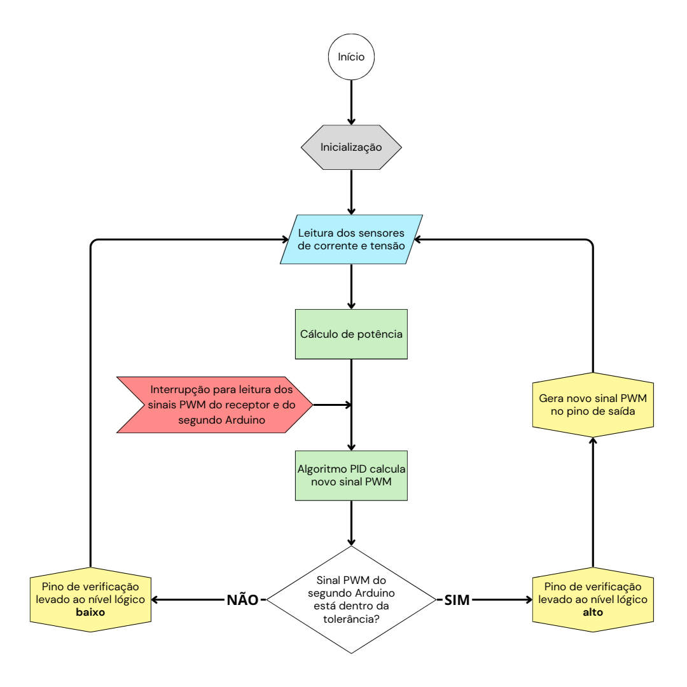

# limitador-potencia

Sistema limitador de potência para motores BLDC com foco no Aerodesign.

## Objetivo

Estamos utilizando um limitador de potência a fim de cumprir as restrições do regulamento.
Nosso GMP (conjunto motor/hélice/bateria) é capaz de consumir mais de 800 W de potência, então,
para maximizar o empuxo e a pontuação na competição, desenvolvemos este sistema.

## Como funciona

O sistema é composto por dois Arduinos Nano executando o mesmo código.
Cada Arduinos fará a leitura dos sensores de corrente e de tensão, e do sinal PWM vindo do receptor.

Após realizar as leituras, cada Arduino vai calcular um novo PWM para o motor levando em conta
a potência obtida dos sensores, de modo que a potência do motor não ultrapasse um determinado valor.

Cada Arduino também faz a leitura do PWM gerado pelo outro e verifica se está dentro de uma tolerância.
Caso um dos Arduinos perceba que o PWM gerado pelo outro Arduino está fora da tolerância,
seja por uma discrepância nos valores ou por uma falha no segundo Arduino,
um pino de verificação (Check) será levado ao nível lógico baixo, fazendo com que o PWM
dos Arduinos seja barrado e o PWM do receptor seja enviado ao ESC.

### Leitura dos sinais PWM

Para ler os sinais PWM do receptor e do segundo Arduino, foram utilizados os dois pinos de interrupção
do Arduino Nano (pinos digitais 2 e 3). As interrupções foram configuradas no modo CHANGE, ou seja, 
cada vez que o pino associado mudar de estado (seja de alto para baixo ou o contrário) 
a interrupção será executada.

Existem duas ISRs, cada uma associada a um pino. Seus códigos são idênticos, mudando apenas algumas variáveis.

Primeiro, a ISR armazena o tempo atual usando `millis()` e ativa a flag associada. Então, é feita a leitura
do pino que ativou a interrupção. Se estiver em nível alto, significa que está no início do pulso, o tempo atual
é salvo. Se estiver em nível baixo, o pulso terminou, então a largura do pulso é calculada subtraindo o tempo
atual e o tempo inicial que foi salvo anteriormente.

### Fluxograma

## Estrutura do repositório

- **limitador-potencia.ino** - Arquivo principal que inicializa o sistema;
- **params.hpp** - Arquivo que contém todas as configurações do sistema. Nele, são definidos os pinos, parâmetros, estruturas de dados e constantes;
- Pasta **src/** - Arquivos fonte contendo as funções utilizadas no arquivo principal;
- Pasta **inc/** - Arquivos cabeçalho contendo os protótipos das funções.

### Arquivos fonte

- **current.cpp** - funções relacionadas à leitura de corrente do motor;
- **voltage.cpp** - funções relacionadas à leitura de tensão da bateria;
- **pwm.cpp** - funções relacionadas à leitura dos sinais de PWM;
